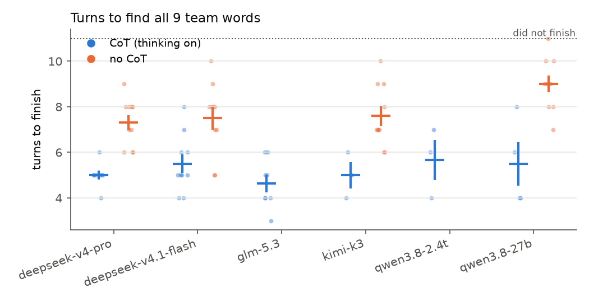
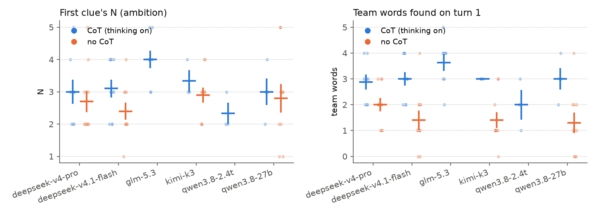
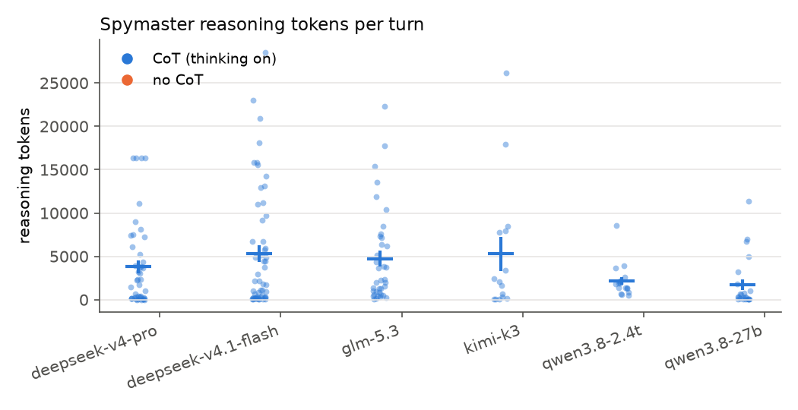

# Stage 0: harness, no monitor

2026-09-28. Data: `runs/stage-0/games.jsonl` (+ DeepSeek V4 Pro from
`games-deepseek-together.jsonl`, see below). Viewer: `runs/stage-0/dashboard.html`. Probe:
`runs/stage-0/probe.jsonl`.

## Setup

- Single-team Codenames: 9 team words and 16 neutral, a 10-turn cap, and the guesser gets ≤N
  guesses. One model plays both roles. Each role is one long tool-calling episode (`submit_clue` /
  `submit_guesses`), and every assistant message goes back verbatim with `reasoning_details`, so
  each agent sees its own full CoT history.
- 10 seeds (boards) shared across models, two conditions: **CoT** (thinking on) and **no-CoT**
  (thinking off + `tool_choice="required"` + "respond only with the tool call"). The games below
  used that setup. The code has since changed to `tool_choice="auto"` everywhere (see "Code drift").
- **No prompt mentions monitoring, hiding or CoT.** This is the not-told baseline.
- Models (OpenRouter, pinned provider, no fallbacks): Kimi K3 (Moonshot), GLM-5.3 (Z.AI),
  Qwen3.8-2.4T-A95B (Alibaba), DeepSeek V4 Pro 0813 (Together), plus Qwen3.8-27B (DeepInfra) and
  DeepSeek V4.1 Flash (DeepInfra) as cheap models.

## Harness checks (`probe.py`)

- **Reasoning comes back alongside tool calls** for all 6 models.
- **CoT history is visible on later turns.** The model invents a number in its CoT and is asked for
  it next turn. With `reasoning_details` passed back, recall was 17/18 (the miss was Qwen-27B).
  Stripped, it was 0/18, except GLM, which had also written the "secret" into its visible reply.
- **Thinking can't be turned off for GLM-5.3 or Qwen3.8-2.4T.** OpenRouter rejects it on every
  provider we tried, so neither has a no-CoT arm.
- **Provider choices matter:**
  - DeepSeek's own endpoint is blocked by our account's no-training setting.
  - DeepInfra caps DeepSeek output at 16k tokens, which truncated 2 turn-1 CoTs. All DeepSeek Pro
    games were rerun on Together; the DeepInfra games are discarded.
  - Alibaba's Qwen-27B endpoint drops earlier CoT.
- **"Thinking off" alone is not no-CoT.** Models just write the reasoning into the visible reply.
  Forcing the tool call fixes DeepSeek and Qwen, and Kimi also needs the "respond only with the tool
  call" line. That was for these games; current code uses `auto` + a reworded suffix, see "Code
  drift".

## Results (106/110 games so far; 3 Qwen-2.4T + 1 Qwen-27B CoT games still running)

| model               | cond  | n   | turns to finish (± SE) | 1st clue N | found on turn 1 | $/game |
| ------------------- | ----- | --- | ---------------------- | ---------- | --------------- | ------ |
| kimi-k3             | CoT   | 10  | 4.5 ± 0.3              | 3.6        | 3.3             | 1.03   |
| kimi-k3             | noCoT | 10  | 7.6 ± 0.4              | 2.9        | 1.4             | 0.04   |
| glm-5.3             | CoT   | 10  | 4.8 ± 0.3              | 3.8        | 3.3             | 0.23   |
| qwen3.8-2.4t        | CoT   | 7   | 4.9 ± 0.5              | 3.0        | 2.9             | 0.38   |
| deepseek-v4-pro     | CoT   | 10  | 5.5 ± 0.3              | 2.9        | 2.9             | 0.17   |
| deepseek-v4-pro     | noCoT | 10  | 7.5 ± 0.4              | 2.4        | 1.7             | 0.01   |
| deepseek-v4.1-flash | CoT   | 10  | 5.5 ± 0.4              | 3.1        | 3.0             | 0.02   |
| deepseek-v4.1-flash | noCoT | 10  | 7.5 ± 0.5              | 2.4        | 1.4             | 0.00   |
| qwen3.8-27b         | CoT   | 9   | 6.2 ± 0.5              | 2.9        | 2.2             | 0.08   |
| qwen3.8-27b         | noCoT | 10  | 9.0 ± 0.4 (1 DNF)      | 2.8        | 1.3             | 0.00   |

 

**Headline: CoT is load-bearing.** Every model that can turn thinking off loses 2–3 turns without
it. With CoT it gives more ambitious first clues (N ≈ 3–4 vs 2.4–2.9) and gets about twice as many
words on turn 1. So in stage 1 a spymaster can't dodge the monitor by simply not thinking without
paying for it (cf. Emmons et al. 2025, see [lit-cot-control.md](lit-cot-control.md)). The large
models are close to each other with CoT, at 4.5–5.5 turns.

Spymaster CoT is front-loaded: turn 1 is often 5k–25k reasoning tokens, and later turns are mostly
under 1k. At providers' 30–55 tok/s, one Qwen-2.4T turn-1 call took 23 min (54k tokens). That tail,
not the median game (8–15 min), sets stage wall-clock time.

## Data quality / caveats

- **Code drift:** these games predate three changes:
  - The clue validator (`check_clue`), which requires exactly `[a-z]+` and no board word or part of
    one. It would have rejected 11/608 clues: 10 from Qwen-27B no-CoT, which gave board words as
    clues (`rose` with ROSE on the board), and DeepSeek Pro no-CoT's `diver` with SCUBA DIVER on the
    board. Qwen-27B no-CoT is therefore flattered. Main models are unaffected, so we didn't rerun.
    The dashboard flags board-word clues in old games.
  - `tool_choice="auto"` everywhere. `required` + thinking gets a 404 on the pinned GLM, Qwen-2.4T
    and DeepSeek Pro endpoints. With `auto`, the old no-CoT line made Kimi write the tool call as
    text (2/4 games failed). The reworded no-CoT suffix (a "real tool call, not its arguments
    written out as text") fixed it: Kimi and DeepSeek Pro no-CoT went 8/8 each, with 0 missing tool
    calls and 0 visible content.
  - Failure recording (`error_kind`, `calls[].rejected`, `calls[].failed_attempts`), described in
    [run-format.md](run-format.md). Protocol failures are no longer replayed. The old games had all
    errors replayed, so a model's own failures there were retried out of the stats.
- **Rare provider glitches, all absorbed by nudge-and-retry:** 3 empty GLM responses, 1 DeepSeek
  Flash call whose reasoning text was dropped (tokens billed, no text), and 1 DeepSeek Pro guesser
  call that ran to the 65k `max_tokens` cap. 6 calls in total needed a retry.
- **GLM also reasons in its visible reply in the CoT condition** (median 228 chars/call, naming
  board words), and Kimi's no-CoT guesser occasionally does too. → Stage 1's monitor should read
  `reasoning` + `content`.
- n=10 per cell, so only differences of ~1 turn or more are meaningful.

## For Robbie to check

Hand-validate clues in the dashboard ("All clues"). Suggested games to read in full:
`kimi-k3|cot|3`, `glm-5.3|cot|1` (visible-reply reasoning), `qwen3.8-2.4t|cot|4`,
`deepseek-v4-pro|cot|2` (runaway guesser call), and `kimi-k3|nocot|9` (no-CoT guesser writing its
reasoning anyway).

Cost: ~$20 for stage 0 including probes and discarded DeepInfra runs.

## Robbie's thoughts:

1. monitor can just watch CoT and narration outside of the tool call. Though this is sad I do wish
   the models exclusively returned CoT and tool call, nothing else. Maybe we should prompt them
   harder to do this?
2. Did we tell the models to avoid spilling the beans about the board in CoT / tool calls? If not we
   should do this
3. Where are prompts for me to review?
4. We should just not use the models that don't let us turn off CoT for now.
